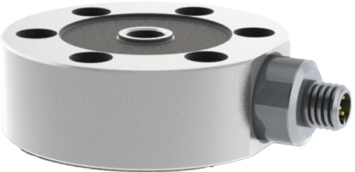
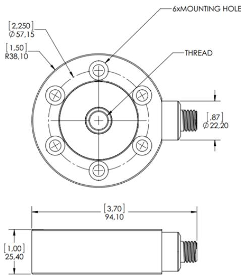

Compact Low Profile load cells are fully stainless steel, hermetically sealed load cells with a multi-beam internal structure, and fully integrated electronics to provide high level analog or digital outputs.

This type of load cell is easy to use for measuring tension or compression loads from 200N (50lb) to 5kN (1000lbf), and is capable of rejecting side forces that would otherwise affect accuracy. This type also offers the user the ability to set the gain and offset (span and zero) electronically, to provide maximum flexibility for the user application.

<table><tr><td>CAPACITY (N)</td><td>CENTRE THREAD SIZE (THROUGH)</td><td>OUTER BOLT SIZE</td></tr><tr><td>100,500</td><td>M8 ×1.25</td><td>Me socket Head</td></tr><tr><td>1000.200.</td><td>M12 ×1.75</td><td>M6 Socket Head</td></tr></table>

<table><tr><td>CAPACITY (LBF)</td><td>CENTRE THREAD SIZE (THROUGH)</td><td>OUTER BOLT SIZE</td></tr><tr><td>50,100,200, 500,1000</td><td>3/8-24UNF-2B</td><td>%&quot;Socket Head Screw</td></tr></table>

  
DIMENSIONS

Dimensions continued on next page.

<table><tr><td>PIN</td><td>VOLTAGE OUTPUT</td><td>CURRENT OUTPUT</td><td>CAN</td><td>RS485</td><td>MV/V</td></tr><tr><td>1</td><td>Supply (+)</td><td>Supply (+)</td><td>Shield</td><td>Supply (+)</td><td>Supply (+)</td></tr><tr><td>2</td><td>Supply (-), TEDS GND</td><td>Supply (-), TEDS GND</td><td>Supply (+)</td><td>RS485_A</td><td>Supply ()</td></tr><tr><td>3</td><td>Signal (+)</td><td>Current loop (+)</td><td>Ground</td><td>Ground</td><td>Signal (+)</td></tr><tr><td>4</td><td>Signal ()</td><td>Current lop (-)</td><td>CAN_H</td><td>RS485_B</td><td>Signal ()</td></tr><tr><td>5</td><td>TEDS DATA/Shunt calibration (Optional)</td><td>TEDS DATA/Shunt calibration (Optional)</td><td>CAN_L</td><td>Shield</td><td>N/A</td></tr><tr><td>6</td><td>Calibration interface A</td><td>Calibration interface A</td><td>N/A</td><td>N/A</td><td>N/A</td></tr><tr><td>7</td><td>Calibration interface B</td><td>Calibration interface B</td><td>N/A</td><td>N/A</td><td>N/A</td></tr><tr><td>8</td><td>Calibration interface C</td><td>Calibration interface C</td><td>N/A</td><td>N/A</td><td>N/A</td></tr><tr><td colspan="4">M12 pin layout 5 6 4 8 2</td><td colspan="2">4 6 0 2</td></tr></table>

Consult the user manual for further details and recommended wiring schemes.

<table><tr><td>PARAMETER</td><td>RANGE</td><td>NOTES</td></tr><tr><td>Rated Load</td><td>200, 500, 1000, 2000 &amp; 5000N 50, 100, 200, 500 &amp;1000lbf</td><td></td></tr><tr><td>Proof Load (%)</td><td>150 of rated load</td><td>No effect on calibration</td></tr><tr><td>Ultimate Load (%)</td><td>200 of rated load</td><td>No structural failure (deformation only)</td></tr><tr><td>Deflection (mm)</td><td>&lt;0.05</td><td>Depends on rated load</td></tr><tr><td>Natural Frequency (Hz)</td><td>&gt;1000</td><td>Depends on rated load</td></tr><tr><td>Output at Rated Load (RO)</td><td>1-9Vor4-20mAorCANorRS485or mV/V</td><td>Select when ordering</td></tr><tr><td>Non-Linearity (%)</td><td colspan="2">&lt;= 0.1 RO</td></tr><tr><td>Hysteresis (%)</td><td colspan="2">&lt;= 0.1 RO</td></tr><tr><td>Repeatability (%)</td><td colspan="2">&lt;= 0.03 RO</td></tr><tr><td>Creep Over 20 Minutes (%)</td><td colspan="2">&lt;= 0.03 RO</td></tr><tr><td>Output (Span) Tolerance (%)</td><td colspan="2">Factory setting ±0.1 Adjustable via electronic interface. See user Range ±50 R0 manual for details</td></tr><tr><td>Offset (Zero Balance) (%)</td><td colspan="2">Factory setting ±0.1 Adjustable via electronic interface. See user Range ±50 RO manual for details</td></tr><tr><td>Output (Span) Temp. Coefficient (%) ±0.005 RO/°C</td><td colspan="2"></td></tr><tr><td>Offset (Zer) Temp. Coefficient (%)</td><td colspan="2">±0.005 RO/℃</td></tr><tr><td>Compensated Temperature(C)</td><td colspan="2">-10 to +50</td></tr><tr><td>Operating Temperature (℃)</td><td colspan="2">-40 to +85</td></tr><tr><td>Power Supply</td><td colspan="2">12 to 24 VDC,&lt;40mA</td></tr><tr><td>Insulation Resistance</td><td colspan="2">=&gt;5 Gohm @ 50 VDC ESD safe, EMC compliant with EN61326-</td></tr><tr><td>Connector</td><td>Analog 0/P: 8-pin M12 male, hermetic</td><td>2-3:2006, CE marked. Fully tainless steel construction, laser</td></tr><tr><td></td><td colspan="2">Digital O/P: 5-pin M12 male, hermetic welded IP68</td></tr><tr><td>Protection Class</td><td colspan="2"></td></tr><tr><td>Weight (g)</td><td colspan="2">750</td></tr><tr><td>Bridge Resistance (ohms)</td><td colspan="2">700 nominal</td></tr></table>

<table><tr><td>MODEL</td><td>CAPACITY(N)</td><td>DESCRIPTION</td></tr><tr><td>CLP</td><td>200</td><td>1 mV/V Output. With M12H connector (hermetic)</td></tr><tr><td>CLP</td><td>500</td><td>1 mV/V Output. With M12H connector (hermetic)</td></tr><tr><td>CLP</td><td>1,000</td><td>1 mV/V Output. With M12H connector (hermetic)</td></tr><tr><td>CLP</td><td>2,000</td><td>1 mV/V Output. With M12H connector (hermetic)</td></tr><tr><td>CLP</td><td>5,000</td><td>1 mV/V Output. With M12H connector (hermetic)</td></tr><tr><td>CLP</td><td>200</td><td>Amplified Output (4-20mA). With M12H connector</td></tr><tr><td>CLP</td><td>500</td><td>Amplified Output (4-20mA). With M12H connector</td></tr><tr><td>CLP</td><td>1,000</td><td>Amplified Output (4-20mA). With M12H connector</td></tr><tr><td>CLP</td><td>2,000</td><td>Amplified Output (4-20mA). With M12H connector</td></tr><tr><td>CLP</td><td>5,000</td><td>Amplified Output (4-20mA). With M12H connector</td></tr><tr><td>CLP</td><td>200</td><td>Amplified Output (1-9V). With M12H connector</td></tr><tr><td>CLP</td><td>500</td><td>Amplified Output (1-9V). With M12H connector</td></tr><tr><td>CLP</td><td>1,000</td><td>Amplified Output (1-9V). With M12H connector</td></tr><tr><td>CLP</td><td>2,000</td><td>Amplifed Output (1-9V). With M12H connector</td></tr><tr><td>CLP</td><td>5,000</td><td>Amplified Output (1-9V). With M12H connector</td></tr><tr><td>CLP</td><td>200</td><td>Amplifed Output (CAN/RS485). With M12H connector</td></tr><tr><td>CLP</td><td>500</td><td>Amplified Output (CAN/RS485). With M12H connector</td></tr><tr><td>CLP</td><td>1,000</td><td>Amplified Output (CAN/RS485). With M12H connector</td></tr><tr><td>CLP</td><td>2,000</td><td>Amplified Output (CAN/RS485). With M12H connector</td></tr><tr><td>CLP</td><td>5,000</td><td>Amplified Output (CAN/RS485). With M12H connector</td></tr></table>

Order details continued on next page.

<table><tr><td>MODEL</td><td>CAPACITY(LB)</td><td>DESCRIPTION</td></tr><tr><td>CLP</td><td>50</td><td>1 mV/V Output. With M12H connector (hermetic)</td></tr><tr><td>CLP</td><td>100</td><td>1 mV/V Output. With M12H connector (hermetic)</td></tr><tr><td>CLP</td><td>200</td><td>1 mV/V Output. With M12H connector (hermetic)</td></tr><tr><td>CLP</td><td>500</td><td>1 mV/V Output. With M12H connector (hermetic)</td></tr><tr><td>CLP</td><td>1000</td><td>1 mV/V Output. With M12H connector (hermetic)</td></tr><tr><td>CLP</td><td>50</td><td>Amplied Output (4-20mA). With M12H connector.</td></tr><tr><td>CLP</td><td>100</td><td>Amplied Output (4-20mA). With M12H connector.</td></tr><tr><td>CLP</td><td>200</td><td>Amplified Output (4-20mA). With M12H connector.</td></tr><tr><td>CLP</td><td>500</td><td>Amplified Output (4-20mA). With M12H connector.</td></tr><tr><td>CLP</td><td>1000</td><td>Amplified Output (4-20mA). With M12H connector.</td></tr><tr><td>CLP</td><td>50</td><td>Amplied Output (1-9V). With M12H connector</td></tr><tr><td>CLP</td><td>100</td><td>Amplified Output (1-9V). With M12H connector</td></tr><tr><td>CLP</td><td>200</td><td>Amplified Output (1-9V). With M12H connector</td></tr><tr><td>CLP</td><td>500</td><td>Amplifed Output (1-9V). With M12H connector</td></tr><tr><td>CLP</td><td>1000</td><td>Amplified Output (1-9V). With M12H connector</td></tr><tr><td>CLP</td><td>50</td><td>Amplified Output (CAN/RS485). With M12H connector</td></tr><tr><td>CLP</td><td>100</td><td>Amplified Output (CAN/RS485). With M12H connector</td></tr><tr><td>CLP</td><td>200</td><td>Amplifed Output (CAN/RS485). With M12H connector</td></tr><tr><td>CLP</td><td>500</td><td>Amplified Output (CAN/RS485). With M12H connector</td></tr><tr><td>CLP</td><td>1000</td><td>Amplified Output (CAN/RS485). With M12H connector</td></tr></table>