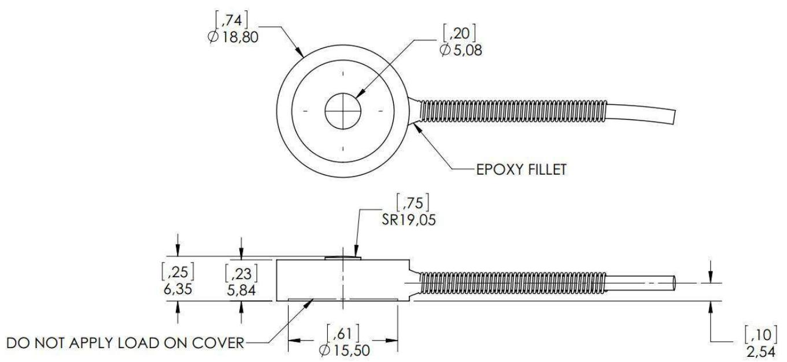

Load Button (ALBS3) is a stainless steel subminiature strain gauge based transducer with compensated temperature performance.

This type of load button provides measurements up to 1000 lb with better than $\pm 0 . 5 \%$ (full scale) non-linearity.

SPECIFICATIONS   

<table><tr><td>PARAMETER</td><td>RANGE</td></tr><tr><td>Capacity (lbf)</td><td>100,200,500,1000</td></tr><tr><td>Rated Output (RO) (mV/V)</td><td>2 nominal</td></tr><tr><td>Safe Overload (%)</td><td>150 of RO</td></tr><tr><td>No Load Offset (Zero Balance) (%)</td><td>±2 of RO</td></tr><tr><td>Excitation (VDC or VAC)</td><td>5 recommended (10 max.)</td></tr><tr><td>Input lmpedance</td><td>350Qnominal</td></tr><tr><td>Non-Linearity (%)</td><td>±0.5 of RO</td></tr><tr><td>Hysteresis (%)</td><td>±0.5 of RO</td></tr><tr><td>Non-Repeatability (%)</td><td>±0.1 of RO</td></tr><tr><td>Temperature Shift Zero (%)</td><td>±0.01 of RO/° F (±0.018 of RO/°C)</td></tr><tr><td>Temperature Shift Span (%)</td><td>±0.02 of Load/° F (±0.036 of Load/C)</td></tr><tr><td>Compensated Temperature (° F)</td><td>+60 to + 160(+ 16 to + 71º℃)</td></tr><tr><td>Operating Temperature (° F)</td><td>-4 to + 176 (-20 to +80°℃)</td></tr><tr><td>Material</td><td>Stainless Steel</td></tr><tr><td>Deflection (in)</td><td>0.001 (0.025mm) nominal</td></tr><tr><td>IP Rating</td><td>IP64</td></tr><tr><td>Calibration Test Excitation (VDC)</td><td>5</td></tr><tr><td>Calibration (td.)</td><td>5 pt. compression</td></tr><tr><td></td><td></td></tr></table>

