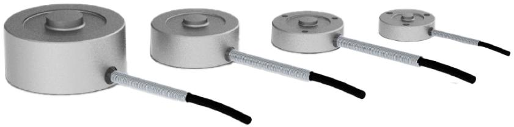
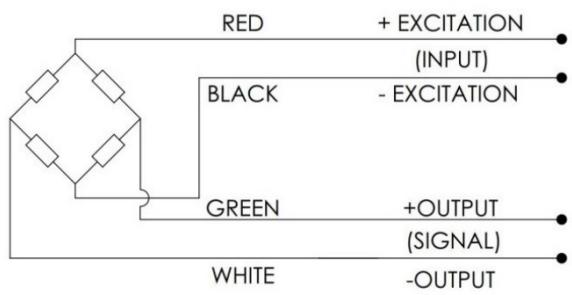
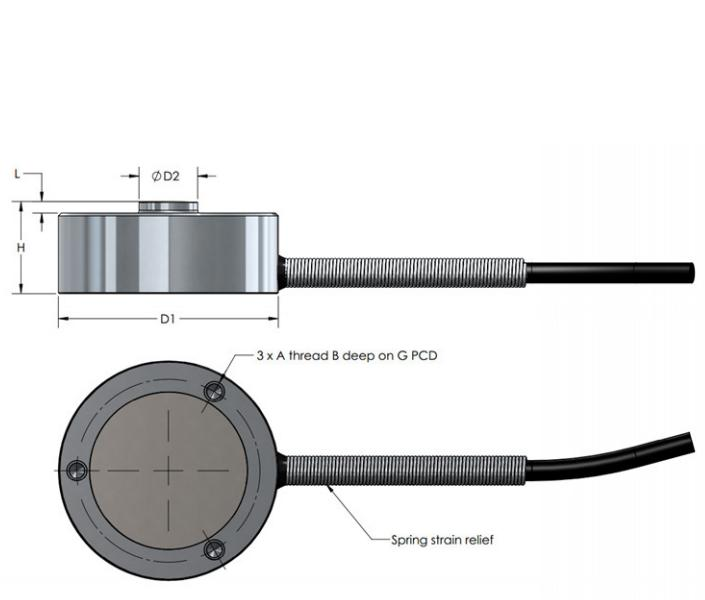

Button Load Cells are strain gauge based transducers with temperature compensation and excellent overall performance.

This type provides a range of capacities up to $2 0 0 ~ \mathsf { k N }$ or $5 0 \ k \ b$ with better than $\pm 0 . 5 \%$ (full scale) non-linearity. Three tapped holes are provided on the underside for ease of mounting. Amplified and digitised versions are available upon request.

# WIRING

• The load button is provided with $4 \times 3 2$ AWG (100N-500N & 25lb – 100lb), $4 \times 2 8$ AWG (1kN200kN & 250lbf – 50klbf) wiring within a braided shielded cable (overall cable length 2m).   
• Connector with integrated TEDS chip is available to order.

  
DIMENSIONS

Dimensions continued on next page.

<table><tr><td></td><td>CAPACITY DEFLECTION (NOM.) (MM) [IN]</td></tr><tr><td>100N</td><td>0.02 [.001]</td></tr><tr><td>200N</td><td>0.04 [.002]</td></tr><tr><td>500N</td><td>0.03 [.001]</td></tr><tr><td>1kN</td><td>0.03 [.001]</td></tr><tr><td>2kN</td><td>0.03 [.001]</td></tr><tr><td>5kN</td><td>0.03 [.001]</td></tr><tr><td>10kN</td><td>0.03 [.001]</td></tr><tr><td>15kN</td><td>0.04 [.002]</td></tr><tr><td>20kN</td><td>0.05 [.002]</td></tr><tr><td>50kN</td><td>0.06 [.002]</td></tr><tr><td>100kN</td><td>0.08 [.003]</td></tr><tr><td>150kN</td><td>0.09 [.003]</td></tr></table>

DIMENSIONS CONTINUED   

<table><tr><td>RANGE</td><td>CAPACITYD1 (MM)</td><td></td><td>D2(MM[IN]H (MM [IN]L(MM [IN]A(IN)</td><td></td><td></td><td>B (MM) [IN]G (MM [IN]</td><td></td></tr><tr><td>ALBM-1M</td><td>100N</td><td></td><td></td><td></td><td></td><td></td><td></td></tr><tr><td>ALBM-1M</td><td>200N</td><td>24.9 [0.98]</td><td>5,33 [0.21] 8.13 [0.32]</td><td>1,27 [0.05]</td><td>M3</td><td>5,59 [0.22]</td><td>19,05[0.75]</td></tr><tr><td>ALBM-1M</td><td>500N</td><td></td><td></td><td></td><td></td><td></td><td></td></tr><tr><td>ALBM-1U</td><td>25lbf</td><td>24.9 [0.98]</td><td></td><td>1,27 [0.05]</td><td></td><td></td><td></td></tr><tr><td>ALBM-1U</td><td>50lbf</td><td></td><td>5,33 [0.21] 8.13 [0.32]</td><td></td><td></td><td>#4-40 UNC5,59[0.22]</td><td>19,05 [0.75]</td></tr><tr><td>ALBM-1U</td><td>100lbf</td><td></td><td></td><td></td><td></td><td></td><td></td></tr><tr><td>ALBM-2M</td><td>1kN</td><td></td><td></td><td></td><td></td><td></td><td></td></tr><tr><td>ALBM-2M</td><td>2kN</td><td>31,75[1.25]8,13 [0.32]</td><td></td><td>9,91 [0.39] 1,27 [0.05]</td><td>M4</td><td>6,35 [0.25]</td><td>25,4[1.000]</td></tr><tr><td>ALBM-2M</td><td>5kN</td><td></td><td></td><td></td><td></td><td></td><td></td></tr><tr><td>ALBM-2M ALBM-2U</td><td>10kN 250lbf</td><td></td><td></td><td></td><td></td><td></td><td></td></tr><tr><td>ALBM-2U</td><td>500lbf</td><td>31,75[1.25]8,13 [0.32]</td><td></td><td></td><td></td><td></td><td></td></tr><tr><td>ALBM-2U</td><td></td><td></td><td>9,91 [0.39]</td><td>1,27 [0.05]</td><td></td><td>#6-32UNC 6,35 [0.25]</td><td>25,4[1.000]</td></tr><tr><td>ALBM-2U</td><td>1klbf 2klbf</td><td></td><td></td><td></td><td></td><td></td><td></td></tr><tr><td>ALBM-3M</td><td>15kN</td><td></td><td></td><td></td><td></td><td></td><td></td></tr><tr><td>ALBM-3M</td><td>20kN</td><td>38,1 [1.50]</td><td>10,16[0.40]16,0 [0.63]</td><td>2,03 [0.08]</td><td>M4</td><td>6,35 [0.25]</td><td>31,75 [1.250]</td></tr><tr><td>ALBM-3M</td><td>50kN</td><td></td><td></td><td></td><td></td><td></td><td></td></tr><tr><td>ALBM-3U</td><td>5klbf</td><td></td><td></td><td></td><td></td><td></td><td></td></tr><tr><td>ALBM-3U</td><td>7.5klbf</td><td>38,1 [1.50]</td><td>10,16[0.40]16,0 [0.63]</td><td>2,03 [0.08]</td><td></td><td>#6-32UNC6,35 [0.25]</td><td>31,75[1.250]</td></tr><tr><td>ALBM-3U</td><td>10klbf</td><td></td><td></td><td></td><td></td><td></td><td></td></tr><tr><td>ALBM-4M</td><td>100kN</td><td>50.3 [1.98]</td><td>15.24[0.60]25.4 [1.00]</td><td>3.05 [0.12]</td><td>M4</td><td>6,35 [0.25]</td><td>41. [1.625]</td></tr><tr><td>ALBM-4M ALBM-4U</td><td>150kN 20klbf</td><td></td><td></td><td></td><td></td><td></td><td></td></tr><tr><td>ALBM-4U</td><td>30klbf</td><td>50.3 [1.98]</td><td>15.24[0.60]」25.4 [1.00]</td><td>3.05 [0.12]</td><td></td><td>#6-32UNC 6,35[0.25]</td><td>41.3 [1.625]</td></tr><tr><td>ALBM-4M</td><td>200kN</td><td>75.7 [2.98]</td><td>19.8 [0.78] 38.1 [1.50]</td><td>4.6 [0.18]</td><td>M4</td><td>6.4 [0.25]</td><td>60.5 [2.375]</td></tr><tr><td>ALBM-4U</td><td>50klbf</td><td>75.7 [2.98]</td><td>19.8 [0.78] 38.1[1.50]</td><td>4.6 [0.18]</td><td></td><td>#6-32UNC 6.4 [0.25]</td><td>60.5[2.375]</td></tr></table>

<table><tr><td>PARAMETER</td><td>RANGE</td><td>NOTES</td></tr><tr><td>Capacity (metric) (N)</td><td>100, 200,500, 1K,2K, 5K, 10K, 15K, 20K, 50K, 100K, 150K, 200K</td><td>With metric threads as standard</td></tr><tr><td>Capacity (lb)</td><td>25, 50,100, 250, 500, 1K, 2K, 3K, 4K, 5K, 7.5K, 10K, 15K, 20K, 30K, 50K</td><td>With UNF threads as standard</td></tr><tr><td>Allowable Maximum Load (%)</td><td>150 full scale</td><td>No effect on performance</td></tr><tr><td>Non-Linearity (%)</td><td>±0.5 FS max.</td><td></td></tr><tr><td>Hysteresis (%)</td><td>±0.3 FS max.</td><td></td></tr><tr><td>Repeatability (%)</td><td>±0.1 FS max.</td><td></td></tr><tr><td>Total Eror (%)</td><td>±0.8 FS max.</td><td>Non-linearity and hysteresis</td></tr><tr><td>Zero Balance (%)</td><td>2 FS max.</td><td></td></tr><tr><td>Zero Temperature Coefficient (%)</td><td>0.01 FS/C</td><td></td></tr><tr><td>Span Temperature Coefficient (%)</td><td>0.02 of load/°C</td><td></td></tr><tr><td>Compensated Temperature (C)</td><td>-15 to +70</td><td>Wider range available to order</td></tr><tr><td>Operating Temperature (°C)</td><td>-20 to +80</td><td>Wider range available to order</td></tr><tr><td>Output (mV/V)</td><td>2nominal (1 for 100N and 25lbf)</td><td>Amplified and digitised versions available to order.</td></tr><tr><td>IP Rating</td><td>IP64- Bonded Cover</td><td>Bonded cover is standard</td></tr><tr><td>Excitation (V)</td><td>5,10</td><td></td></tr><tr><td>Bridge Resistance (ohms)</td><td>350 nominal.-(100N - 500N) &amp; (25lbf -100lbf) 700 nominal - above 1kN &amp; 250lbf</td><td></td></tr></table>